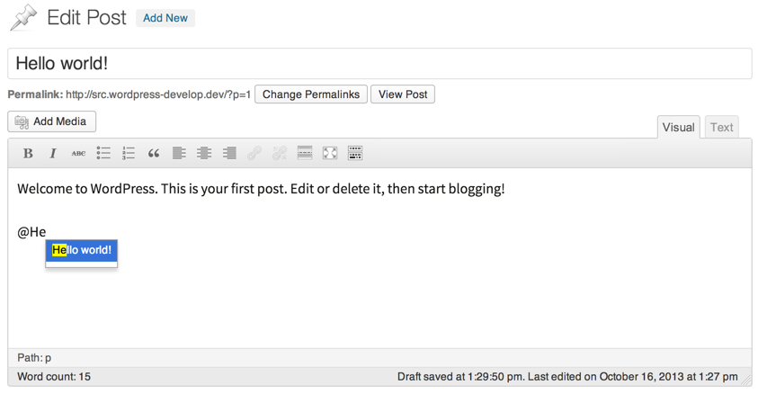
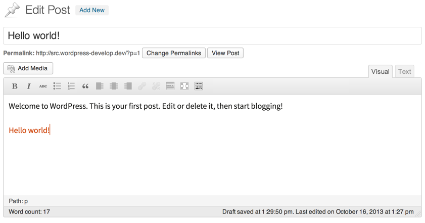

<!-- DO NOT EDIT THIS FILE; it is auto-generated from readme.txt -->
# Mentionable

Mention WordPress content with inline autocomplete inside tinyMCE.

**Contributors:** [x-team](http://profiles.wordpress.org/x-team), [jonathanbardo](http://profiles.wordpress.org/jonathanbardo)  
**Tags:** [tinyMCE](http://wordpress.org/plugins/tags/tinyMCE), [admin](http://wordpress.org/plugins/tags/admin), [mention](http://wordpress.org/plugins/tags/mention)  
**Requires at least:** 3.6  
**Tested up to:** 3.7  
**Stable tag:** trunk (master)  
**License:** [GPLv2 or later](http://www.gnu.org/licenses/gpl-2.0.html)  

## Description ##

**Development of this plugin is done [on GitHub](https://github.com/x-team/mentionable). Pull requests welcome. Please see [issues](https://github.com/x-team/mentionable/issues) reported there before going to the plugin forum.**

## Screenshots ##

### Start typing "@" for the autocomplete to trigger

### After pressing enter, the plugin replace your input with the right link and content

## Changelog ##

### 0.1 ###
First Release

